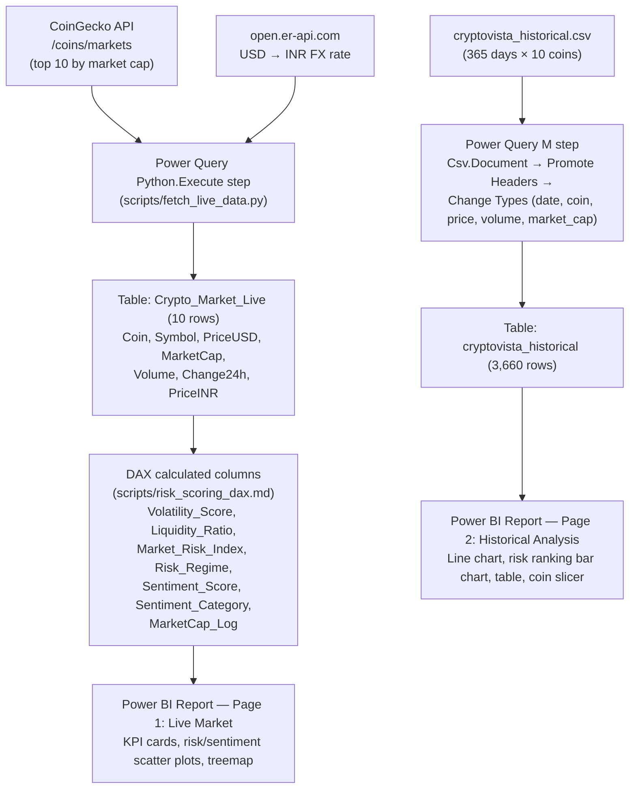

# CryptoVista — Live Market Intelligence Dashboard

**Structural risk signals, not just price tracking.**

A Power BI dashboard that fetches live cryptocurrency market data, enriches it with risk and sentiment scoring, and pairs it with a year of historical price history — giving investors and analysts a fast read on which coins are risky, which are stable, and how the market has moved over the past year.

---

## Overview

| | |
|---|---|
| **Domain** | Cryptocurrency / Financial Analytics |
| **Tools** | Python (requests, pandas), Power BI Desktop, Power Query (M) |
| **Data source** | [CoinGecko API](https://www.coingecko.com/en/api) (free, public) |
| **Dashboard pages** | 2 — Live Market Intelligence, Historical Analysis |
| **Coins tracked** | 10 — BTC, ETH, BNB, SOL, XRP, DOGE, USDT, USDC, TRX, STETH |
| **Data volume** | ~3,650 historical rows (365 days × 10 coins) + 10 live rows, refreshed on demand |

**Business objective:** build a real-time cryptocurrency risk and sentiment monitoring dashboard that helps investors and analysts decide which coins to watch, buy, or avoid.

---

## Repository Contents

```
Crypto vista Dashboard.pbix     Power BI dashboard (the main deliverable)
cryptovista_historical.csv      365-day price/volume/market-cap history for 10 coins
requirements.txt                Python packages needed by the embedded fetch script
scripts/
  fetch_live_data.py            Live-fetch logic, extracted from the Power Query
                                 Python step for readability/version control
  risk_scoring_dax.md           Exact DAX formulas for every risk/sentiment
                                 calculated column, transcribed from the model
```

> The live-fetch logic lives **inside the .pbix itself**, as a Python script step in the Power Query editor (Power Query → Advanced Editor). `scripts/fetch_live_data.py` is that same code extracted to a standalone file purely so it's readable on GitHub — Power BI does not read from this file, and any edits to it need to be pasted back into the Power Query step to take effect.

---

## Architecture



The two tables are **not related** to each other in the Power BI data model — each report page's visuals pull independently from one table or the other.

---

## Data Model

### `Crypto_Market_Live` (live snapshot, 10 rows — one per coin)

| Column | Type | Meaning |
|---|---|---|
| `Coin` | text | Full coin name (e.g. `bitcoin`) |
| `Symbol` | text | Ticker (e.g. `BTC`) |
| `PriceUSD` | number | Current price in USD |
| `MarketCap` | number | Price × circulating supply |
| `Volume` | number | Total USD traded in the last 24h |
| `Change24h` | number | % price change, last 24h |
| `PriceINR` | number | `PriceUSD` converted at the live USD→INR rate |
| `Volatility_Score` | number, **DAX** | `ABS(Change24h)` — magnitude of price movement, direction ignored |
| `Liquidity_Ratio` | number, **DAX** | `DIVIDE(Volume, MarketCap)`, 0 if either is blank — how easily a coin can be traded |
| `Market_Risk_Index` | number, **DAX** | `Volatility_Score * 0.6 + (1 - Liquidity_Ratio) * 0.4` — weighted composite risk score (higher = riskier) |
| `Risk_Regime` | text, **DAX** | `Market_Risk_Index` bucketed: <3 "Low Risk", <6 "Medium Risk", else "High Risk" |
| `Sentiment_Score` | number, **DAX** | Hardcoded lookup by `Symbol` (see caveat below) |
| `Sentiment_Category` | text, **DAX** | Positive / Neutral / Negative, derived from `Sentiment_Score`'s sign |
| `MarketCap_Log` | number, **DAX** | `LOG10(MarketCap)` (blank if MarketCap ≤ 0), used to size bubble charts |

All seven DAX columns are **calculated columns on the `Crypto_Market_Live` table** (Model/Data view → column formula bar) — not part of the Power Query M/Python fetch step, and not DAX *measures* (there are none in this model). Full formulas are transcribed verbatim in [`scripts/risk_scoring_dax.md`](scripts/risk_scoring_dax.md).

> **Caveat — `Sentiment_Score` is static, not live sentiment.** It's a hardcoded `SWITCH` on ticker symbol: `btc→0.25, eth→-0.10, ada→0.05, sol→0.15, xrp→-0.20`, and **every other coin defaults to 0.03** — including BNB, DOGE, USDT, USDC, TRX, and STETH, which make up more than half the coins actually tracked. `ada` isn't even one of the 10 live-tracked coins. This formula predates (or was never updated for) the current coin list, so "Market Sentiment" on the dashboard should be read as a fixed assumption baked into the model, not a real-time signal.
>
> **Caveat — `Market_Risk_Index` weighting is a manually chosen 60/40 split**, not a statistically derived model; treat the Risk Index as directionally useful, not a calibrated risk metric.

### `cryptovista_historical` (365 days × 10 coins, 3,660 rows)

| Column | Type | Meaning |
|---|---|---|
| `date` | datetime | Day of the reading |
| `coin` | text | Ticker |
| `price` | number | Daily closing price (USD) |
| `volume` | number | Daily trading volume |
| `market_cap` | number | Daily market cap |

Loaded via Power Query `Csv.Document` from `cryptovista_historical.csv`, with headers promoted and columns typed to datetime/text/number.

---

## Dashboard Pages

### Page 1 — Live Market Intelligence
*"What is the market doing right now?"*

- **KPI cards**: average Volatility, Sentiment, Market Risk Index, Liquidity, and Assets Tracked
- **Market Risk Landscape** (bubble/scatter): Liquidity Ratio (x) vs Volatility Score (y), bubble size = market cap — shows stablecoins clustering near zero volatility while DOGE/XRP sit in a higher-risk zone
- **Market Sentiment vs Risk Index** (scatter): flags coins where sentiment and actual risk diverge
- **Market Capitalization Dominance** (treemap): share of total tracked market cap per coin

### Page 2 — Historical Analysis
*"What has the market done over the past year?"*

- **Historical Price Trends** (line chart, log scale): 1-year price history per coin, filterable by the coin slicer
- **Risk Index Ranking** (bar chart): coins ranked by average Market Risk Index
- **Coin Market Overview** (table): price, market cap, and averaged risk/volatility/liquidity metrics, color-coded by risk band
- **Coin Slicer**: cross-filters the historical line chart

---

## Business Insights

> Since `Crypto_Market_Live` refreshes from live prices, exact numbers shift between sessions — the figures below are illustrative snapshots, not fixed facts. The underlying patterns (which coins tend to rank as high/low risk, BTC's market dominance) have held across multiple observed refreshes.

- **Market state**: average Risk Index typically in the 0.8–1.5 range with near-neutral average sentiment (~0.03 for most refresh snapshots) — a cautious, non-extreme market read. Note this partly reflects the static Sentiment_Score default (see caveat above) rather than live market mood.
- **Highest risk**: Bitcoin and Ethereum have shown the highest Risk Index in recent snapshots (BTC ~2.0, ETH ~1.5) — counterintuitive at first glance, but explained by the formula: their large 24h price swings (Volatility_Score) combined with a low Liquidity_Ratio (large market cap relative to 24h volume) drive `Market_Risk_Index` up. Smaller/cheaper coins with high Volume-to-MarketCap ratios (e.g. tether, usd-coin) score structurally lower on this formula regardless of actual price stability.
- **Lowest risk**: Tether (USDT) and USD Coin (USDC) consistently show the lowest Risk Index (<0.3) — both are stablecoins with minimal Volatility_Score and stronger Liquidity_Ratio, exactly what the formula is designed to reward.
- **Market structure**: Bitcoin alone regularly accounts for roughly half of the tracked market's total capitalization, with BTC + ETH together typically exceeding 65–70% combined — when BTC moves, the broader tracked market tends to follow.
- **Historical trend (from `cryptovista_historical.csv`)**: BTC's 365-day series shows a rally from roughly the $60K range toward a peak near $95K, followed by a correction back down — a classic accumulation → rally → correction cycle, visible on the Page 2 log-scale line chart.
- **Actionable takeaway, with the caveat above in mind**: `Market_Risk_Index` as currently formulated rewards stablecoins and penalizes large, liquid-but-volatile assets like BTC/ETH — useful for spotting *short-term volatility risk*, but not a substitute for fundamental risk assessment. Anyone using this dashboard to make decisions should read `Volatility_Score` and `Liquidity_Ratio` individually rather than relying on the composite index alone.

---

## Data Cleaning Notes

A few real issues were hit and fixed while building this:

- A CoinGecko response occasionally includes an unexpected, non-crypto entry (`figure-heloc`) among the top-10-by-market-cap results — this is filtered out at the visual level in the Page 1 report, though it still appears in the raw `Crypto_Market_Live` table preview in Power Query (by design, since the filter is applied in the report, not the query).
- The historical CSV's `date` column initially loaded as text; fixed by explicitly typing it to Date/Time in Power Query (a plain Date type wasn't enough given the timestamp format).
- Power Query header promotion had to run *before* type conversion — doing it in the wrong order left columns named `Column1`, `Column2`, etc.
- Scatter charts defaulted to `Sum` aggregation on their axes, which is meaningless for per-coin metrics like Volatility Score — switched all numeric fields to `Average`.
- Low-priced coins (fractions of a cent) were invisible on a linear price axis alongside BTC — solved with a log scale on the historical price chart.
- The historical dataset originally only covered 4 coins; extended to all 10 tracked coins via the CoinGecko historical endpoint.

---

## Setup

1. Install [Power BI Desktop](https://powerbi.microsoft.com/desktop/) (Windows).
2. Install Python and the packages the embedded fetch step needs: `pip install -r requirements.txt`.
3. In Power BI Desktop, point it at that Python install: **File → Options → Python scripting → Detected Python home directories**.
4. Open `Crypto vista Dashboard.pbix`.
5. To refresh live data: **Home → Refresh**. This re-runs the embedded Python step (`scripts/fetch_live_data.py`).
6. `cryptovista_historical.csv` must be present at the path referenced in the `cryptovista_historical` query (Power Query → Data Source Settings, if you've moved the file).

---

## Known Limitations

- `Sentiment_Score` is a hardcoded lookup covering only 5 of the 10 tracked coins (BTC, ETH, SOL, XRP explicitly, plus ADA which isn't even tracked) — everything else silently defaults to 0.03. Not a live sentiment signal.
- `Market_Risk_Index`'s 60/40 volatility/liquidity weighting is a manual heuristic, not a validated or backtested model — it can rank large stable assets like BTC/ETH as "riskier" than small illiquid coins purely due to their lower liquidity ratio.
- No relationships are defined between `Crypto_Market_Live` and `cryptovista_historical` in the data model — Page 2's visuals pull independently from each table rather than joining them.
- Live data covers only the current top 10 coins by market cap; no pagination/search for other coins.
- The `figure-heloc` CoinGecko anomaly is filtered at the report/visual level, not at the data source — it will reappear if new visuals are built without applying the same filter.

---

## Future Improvements

- Predictive modeling (ARIMA / Prophet) for 30-day price forecasting
- Scheduled automated refresh (hourly live fetch)
- Expand coverage from top 10 to top 50 coins with search/pagination
- Threshold-based alerting on Risk Index
- Portfolio tracker with what-if scenario analysis ("if BTC drops 10%, portfolio = ?")
- Real-time NLP sentiment sourced from Twitter/Reddit, replacing the static sentiment score
- Coin-to-coin correlation matrix
- Rolling 7-day / 30-day volatility trends instead of point-in-time values
